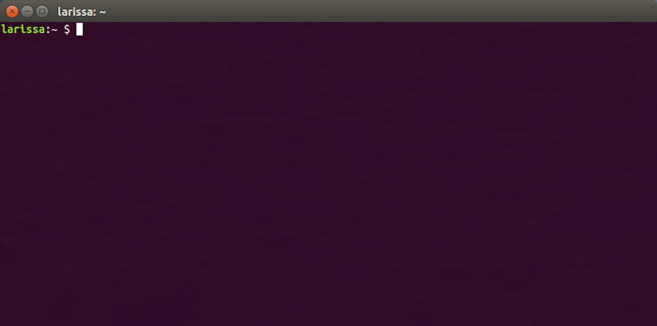

# Why Do I Care?
##

Let's talk about.. actual datasets

## 

"I emailed you the data... take a look and see what you think"

boss emails you some random csv file

or worse, xls

##

"I shared it in dropbox..."

coworker slacks you a dropbox or s3 bucket url

usually world readable

## 

"Have Julie get you access to the marketing database... just tell her I said it's ok"

boss blows you off

## 

"Just google around for an API that'll give you what you need for that analysis..."

coworker blows you off too

## 

..._Now_ What?

# Agenda

- Data about data
- Tools

This series will cover two things:

- practical metadata

- tools you can use to extract that metadata

Along the way, we'll get our feet wet in using the command line

Note that we'll gloss over some topics and allude to others here.
Don't worry, we'll cover _all_ of this material in a lot more
detail throughout the course.  This is meant to give you a feel
for the power of some of the tools involved.

# Data
##

##

- Format
- Schema / Types
- Count
- Presence
- Versioning
- Lineage
- ...

data about data

some of the many dimensions of metadata

the list keeps going...
- Durability
- Availability
- Access/Authorization
- Dependencies
- ...

and varies from dataset to dataset

#
## Format

- csv
- json
- avro
- ...

There're tons of file formats around

We'll go into more detail of lots of these formats later in the course

Focus for now on two common text-based formats: csv and json

## Format

- text (csv, tsv, json, xml, ...)
- binary (avro, parquet, xls, ...)

don't forget to consider zipped up text!

## Format

[screencast exploring file formats from the command-line]

show `cat views.json | jq -C . | more`

show `cat views.xml | xmllint --format - | pygmentize -l xml | more`

#
## Schema / Types

[screencast on schema exploration from the command-line]

show screencast example using jq

#
## Data Count

[screencast on counting content from the command-line]

show screencast example using jq, grep, and wc

#
## Presence

[screencast on content exploration from the command-line]

show screencast example using jq and grep

#
## Data Ranges

[screencast on finding ranges of types from the command-line]

show screencast example using jq, grep, uniq, and sort

how does this differ for really large datasets?

#
## Data Lineage

[screencast on data lineage from the command-line]

what is the history of fields in this dataset?

dunno really what to show here

#
## Data Access

[screencast on accessing data from the command-line]

does it contain private data?

should access to this be restricted?

if so, how will users access this dataset?

this feeds directly into activity02

# Tools
##

##

- The Command Line
- Jupyter
- Excel
- IDEs
- Spark/Impala/Beeline/HBase/DB Shell
- REPLs
- Other Exploratory Environments

#
## The Command Line

surprise!  what we've been doing

## The Command Line - pros

- flexible
- powerful
- everywhere
- quick-n-dirty

## The Command Line - cons

- steep learning curve
- too flexible?
- not inherently scalable

#
## Jupyter Notebooks

notebooks are great for data exploration.

This is where you will likely spend most of your working
days as a data scientist

excellent way to take things to the next level.

don't forget zeppelin!

## Jupyter Notebooks - pros

- flexible
- powerful
- real programming languages
- collaborative

## Jupyter Notebooks - cons

- not always available
- not inherently scalable
- requires programming expertise

#
## Shells

spark / pyspark
impala
beeline
hbase
etc

maybe even mention ipython here?

# Summary

- Data about data
- Tools

We covered two things:

- practical metadata

- tools you can use to extract that metadata

We saw some of the power of the command line in our examples
and associated activities.

Data exploration is really important, so we'll
revisit all of this material in greater detail
using various different tools throughout the course.

#

# scratch

# This Course
##

_Just enough_ data engineering to be effective as a data scientist

A survey of the domain of Data Engineering

## Organization

Based on data pipeline patterns

## { data-background="images/classifying-with-state.svg" }

We'll maintain context along the way using a common pipeline pattern

## Topics 

- Sourcing and Ingesting
- Storing
    - Encoding
    - Evolving
- Transforming
    - Batch Processing
    - Stream Processing
- Querying
    - Accessing
    - Languages and Tools
    - Planning
    - Optimizing
    - Productionalizing
- Understanding and Acting
    - Modeling
    - Analyzing
    - Tracking and Auditing
    - Monitoring
- Visualizing and Communicating

